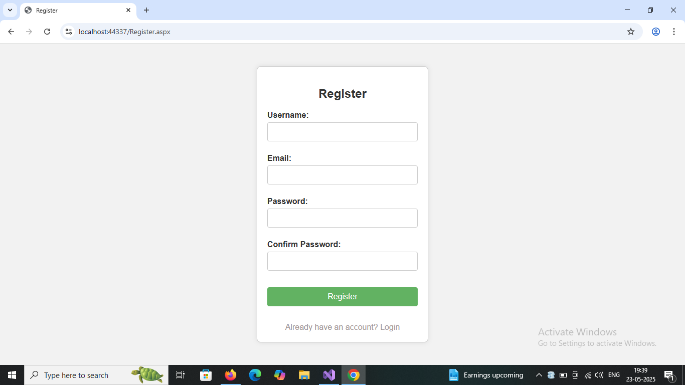
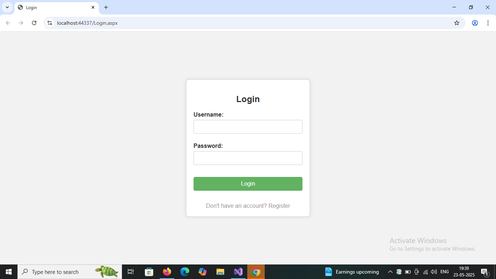
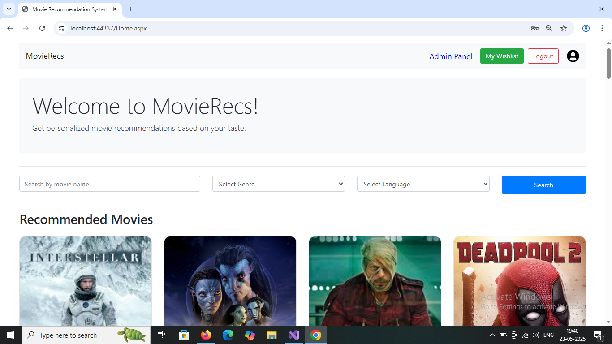
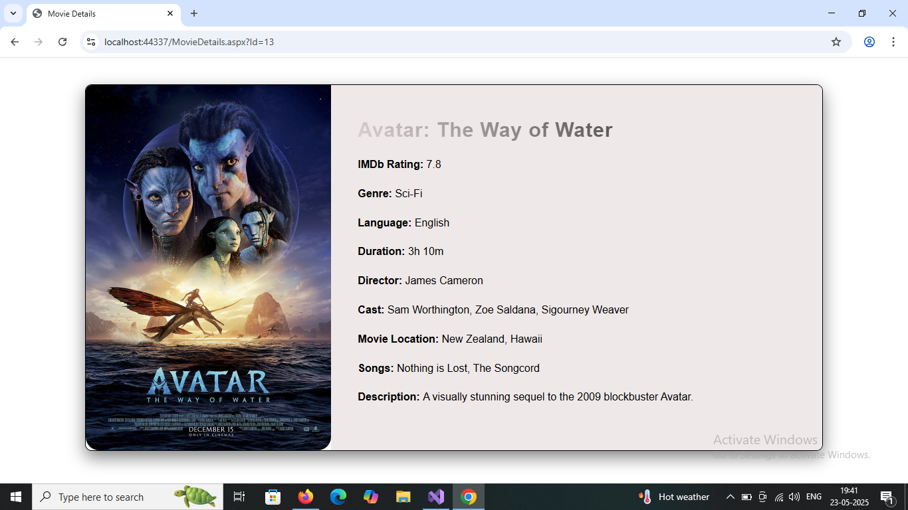
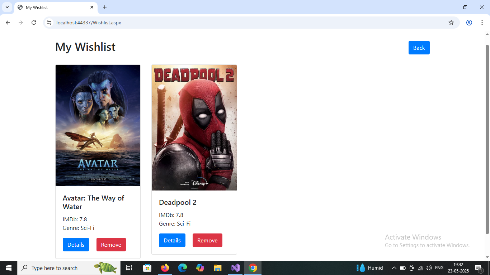
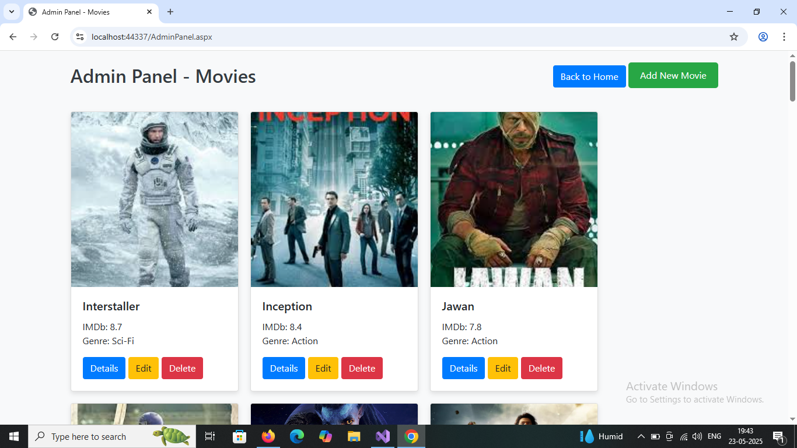
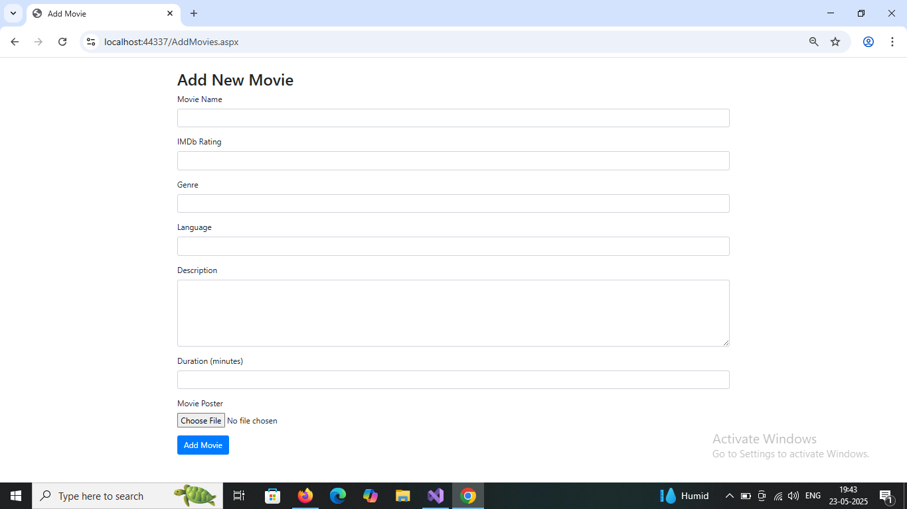

# MovieRecs

MovieRecs is a web-based movie recommendation system built using C# and the ASP.NET framework. It allows users to discover, search, and receive personalized movie recommendations through a user-friendly interface.

## Features

- Personalized movie recommendations based on user preferences
- Search movies by title, genre, or rating
- User registration and authentication
- Modern responsive UI
- Admin panel for managing movies and users

## Technologies Used

- C#
- ASP.NET
- CSS

## Getting Started

### Installation

1. **Clone the repository:**
   ```bash
   git clone https://github.com/Parthiv-03/MovieRecs.git
   ```

2. **Configure the database:**
   - Update the connection string in `appsettings.json` to point to your SQL Server instance.

3. **Apply migrations and seed data (if needed):**
   - Open the project in Visual Studio.
   - Use the Package Manager Console:
     ```
     Update-Database
     ```

4. **Run the application:**
   - Press `F5` in Visual Studio or use:
     ```bash
     dotnet run
     ```

5. **Visit the app:**
   - Open your browser and go to `https://localhost:5001` (or as specified in the output).

## Screenshots

### Register Page
Allow users to create a new account by providing their details. This page ensures only registered users can access personalized recommendations and features.



### Login Page
Enables existing users to sign in securely.



### Home Page
Displays trending, top-rated, and recommended movies. Users can browse movies, use the search bar, and get personalized suggestions based on their activity.



### Detail Page
Shows detailed information about a selected movie, including its title, description, rating, genre, and songs of that movies.



### Wishlist
Users can add/remove movies to their wishlist for future viewing. The wishlist page displays all movies the user has saved.



### Admin Panel
Accessible to admin users for managing movies settings. Admins can add, update, or remove movies.



### Add Movie Page
Admins can add new movies to the database using a dedicated form, including details like title, genre, release date, and description.



## Usage

- Register or log in to access personalized recommendations and features.
- Browse trending, top-rated, or recommended movies on the homepage.
- Use the search bar to find specific movies.
- View detailed information about each movie.
- Add movies to your wishlist to save them for later.
- Admins can manage movies and users through the admin panel.

## Contributing

Contributions are welcome! Please open an issue or submit a pull request for new features, bug fixes, or suggestions.

---

Developed by [Parthiv-03](https://github.com/Parthiv-03)
